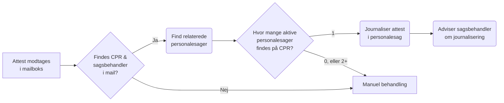

# Bestil-journaliser-attester
|  [**Beskrivelse**](#beskrivelse)  |  [**Afhængigheder**](#afh%C3%A6ngigheder)  |

## Beskrivelse
Formålet med applikationen er at automatisk journalisere attester som fra Politiet modtages på Randers Kommunes hovedpostkasse. 

### Processbeskrivelse
Applikationens process følger Figur 1. Processen kan overordnet opdeles i følgende trin:

#### 1) Attest modtages
Kommunen modtager attester på hovedpostkassen. Herfra er opsat et filter, således at attester videresendes til en attest-postkasse, hvorfra applikationen læser modtagne mails.

#### 2) Mail kontrolleres
Applikationen kontrollerer afsender, titel og indhold af mailen for at sikre, at der er tale om en attest der er videresendt hovedpostkassen. Herunder kontrolleres det at mailen indeholder en mailadresse på en sagsbehandler, samt CPR på den medarbejder attesten omhandler. Såfremt der ikke findes de nødvendige oplysninger, sendes attesten tilbage til hovedpostkassen til manuel behandling

#### 3) Personalesag fremsøges
Der søges i SBSYS efter aktive personalesager på medarbejderen. Findes der 0 eller flere end 1 sag, sendes attesten tilbage til hovedpostkassen til manuel behandling.

#### 4) Attest journaliseres
Attesten journaliseres den aktive personalesag som foreligger i SBSYS. Ligeledes notificeres sagsbehandler på mail om at attesten er modtaget og journaliseret.

## Afhængigheder
Løsningen er afhængig af en række ⚙️ software komponenter og en række ☁️ netværksadgange til eksterne ressourcer for at fungere.

⚙️ |  [Node.js 18](https://docs.npmjs.com/downloading-and-installing-node-js-and-npm)  |  [Node-RED 3.0.2](https://nodered.org/docs/getting-started/windows)  |  [node-red-node-email](https://flows.nodered.org/node/node-red-node-email)  |

☁️ |  [https://cdn.jsdelivr.net/npm](https://cdn.jsdelivr.net/npm) 

☁️  |  https://randers.dk 
